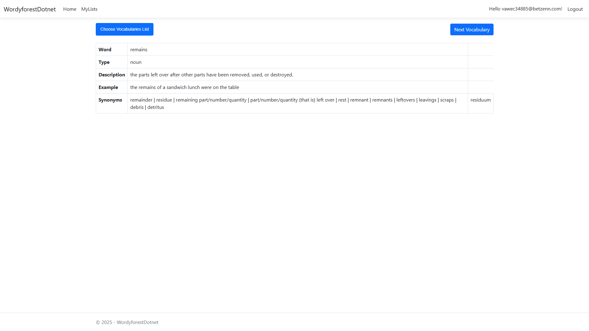
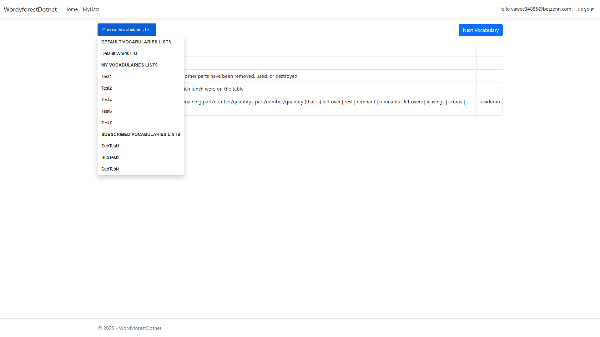
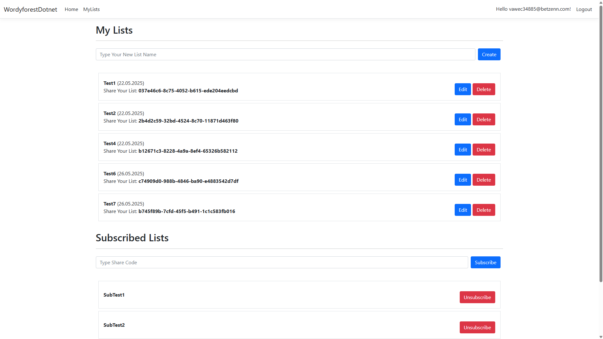
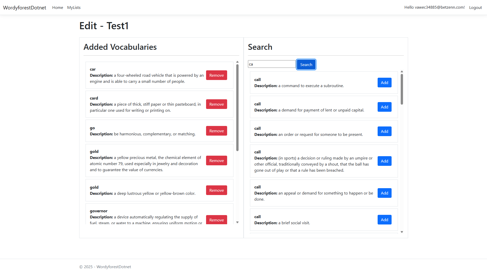

# WordyforestDotnet

WordyforestDotnet is a web-based vocabulary learning platform that helps users expand their vocabulary through interactive word study. The application allows users to discover new words randomly, create personalized vocabulary lists, and subscribe to lists created by other users.

## Features

- **Random Word Discovery**: Explore new vocabulary words randomly presented from the database
- **Personalized Vocabulary Lists**: Create and manage your own custom vocabulary lists
- **Subscriptions**: Subscribe to vocabulary lists created by other users
- **Word Details**: View comprehensive word information including:
  - Word type (noun, verb, adjective, etc.)
  - Descriptions and definitions
  - Example usage
  - Synonyms

## ScreenShots





## Technologies

### Backend
- **ASP.NET Core 8.0**: Modern, cross-platform framework for building web applications
- **Entity Framework Core**: ORM for database operations
- **PostgreSQL**: Robust, open-source relational database
- **ASP.NET Core Identity**: Authentication and user management

### Frontend
- **Razor Views**: Server-side rendering of dynamic content
- **JavaScript**: Client-side interactivity
- **Bootstrap**: Responsive UI components and styling

## Architecture

The application follows a clean architecture pattern with:
- **Models**: Entity classes representing the domain objects (Vocabulary, VocabulariesList, etc.)
- **Controllers**: Handle HTTP requests and user interactions
- **Services**: Business logic layer for vocabulary and list management
- **Views**: User interface templates

## Getting Started

1. Ensure you have the .NET 8.0 SDK installed
2. Configure your PostgreSQL connection string in `appsettings.json`
3. Run database migrations to set up the schema
4. Build and run the application

## License

This project is licensed under the Apache License 2.0 - see the [LICENSE](LICENSE) file for details.

```
Copyright 2025

Licensed under the Apache License, Version 2.0 (the "License");
you may not use this file except in compliance with the License.
You may obtain a copy of the License at

    http://www.apache.org/licenses/LICENSE-2.0

Unless required by applicable law or agreed to in writing, software
distributed under the License is distributed on an "AS IS" BASIS,
WITHOUT WARRANTIES OR CONDITIONS OF ANY KIND, either express or implied.
See the License for the specific language governing permissions and
limitations under the License.
```
